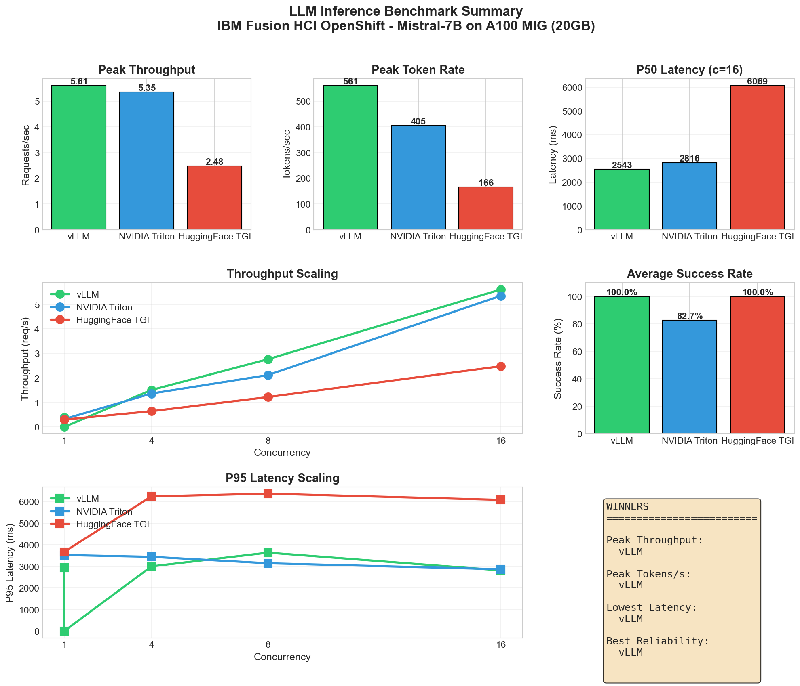
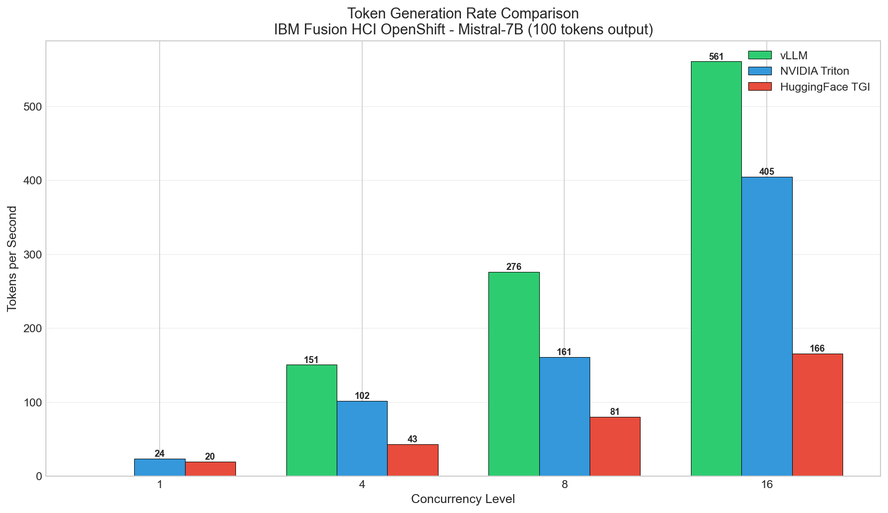
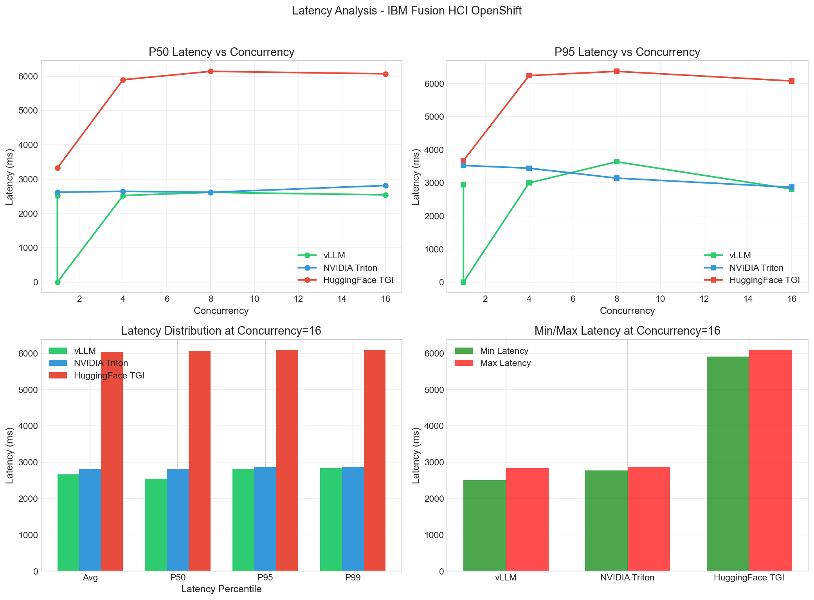
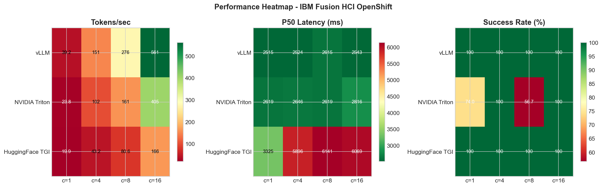
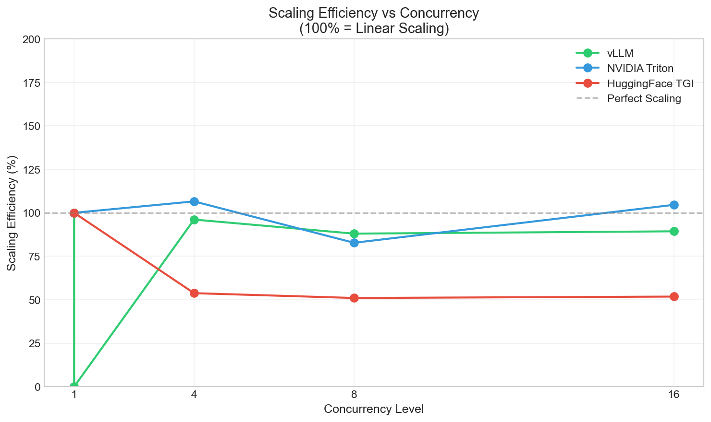

# LLM Inference Benchmarking Framework for OpenShift

A comprehensive, GPU-agnostic benchmarking framework for comparing LLM inference performance across **vLLM**, **NVIDIA Triton**, and **HuggingFace TGI** on Red Hat OpenShift clusters.

**Author:** Deepak Soni
**Contact:** deepak.satna@gmail.com



## Overview

This project provides a **reusable benchmarking framework** for evaluating LLM inference servers on OpenShift with GPU acceleration. While the reference implementation was tested on IBM Fusion HCI with NVIDIA A100 MIG GPUs, the framework is designed to work with **any CUDA-compatible GPU**.

### Key Features
- Production-ready Kubernetes manifests for deploying LLM inference servers
- ACM (Advanced Cluster Management) ManifestWork templates for managed OpenShift clusters
- Universal benchmark client supporting multiple backends with identical test conditions
- Visualization tools for performance analysis and comparison
- Complete troubleshooting documentation for OpenShift GPU workloads
- Dockerfiles for building custom images with pre-downloaded models

### GPU Compatibility

This framework supports any CUDA-compatible GPU, including but not limited to:

| GPU Family | Examples | Notes |
|------------|----------|-------|
| **NVIDIA Data Center** | A100, H100, L40S, A10, T4 | Full support |
| **NVIDIA MIG Partitions** | A100 MIG (various sizes) | Tested configuration |
| **NVIDIA Consumer** | RTX 4090, RTX 3090 | Adjust memory settings |
| **AMD (ROCm)** | MI250, MI300 | Requires ROCm-compatible images |

> **Note:** Performance results will vary based on GPU architecture, memory capacity, memory bandwidth, and compute capability. The benchmark results in this repository are specific to the test environment and should be used as a reference point, not absolute values.

## Reference Benchmark Results

The following results were obtained on the reference test environment (A100 MIG 20GB). **Your results will vary** based on your specific GPU hardware.

| Backend | Peak Throughput | P50 Latency | Success Rate | Notes |
|---------|-----------------|-------------|--------------|-------|
| **vLLM** | **560.71 tok/s** | 2543 ms | 100% | FP16, Best Overall |
| **Triton** | 404.72 tok/s | 2816 ms | 100% | vLLM Backend |
| **TGI** | 165.60 tok/s | 6069 ms | 100% | 4-bit Quantized |

**Winner: vLLM** - 3.4x faster than TGI, 1.4x faster than Triton

> **Important:** These results are specific to the test environment below. Performance will differ on other GPUs due to variations in memory bandwidth, compute units, and architectural differences. Use this framework to benchmark your own hardware for accurate performance data.

## Reference Test Environment

| Component | Specification |
|-----------|---------------|
| **Platform** | IBM Fusion HCI |
| **OpenShift** | 4.20.8 |
| **GPU** | NVIDIA A100 MIG (20GB partition) |
| **Model** | Mistral-7B-Instruct-v0.2 |
| **Management** | Red Hat ACM (Advanced Cluster Management) |

### Expected Performance Scaling by GPU

| GPU | Approx. Memory | Expected Performance vs A100 MIG |
|-----|----------------|----------------------------------|
| H100 80GB | 80GB | ~2-3x faster |
| A100 80GB | 80GB | ~1.5-2x faster |
| A100 40GB | 40GB | ~1.2-1.5x faster |
| **A100 MIG 20GB** | 20GB | **Baseline (this test)** |
| L40S | 48GB | ~0.8-1.2x |
| A10 | 24GB | ~0.5-0.8x |
| T4 | 16GB | ~0.3-0.5x (may require quantization) |

*Performance estimates are approximate and depend on model size, batch size, and configuration.*

## Repository Structure

```
.
├── README.md                          # This file
├── docs/
│   ├── DEPLOYMENT_GUIDE.md           # Step-by-step deployment instructions
│   ├── TROUBLESHOOTING.md            # Common issues and solutions
│   └── BENCHMARK_GUIDE.md            # How to run benchmarks
├── docker/                            # Docker image build files
│   ├── README.md                     # Docker build instructions
│   ├── build.sh                      # Build script for all images
│   ├── vllm/
│   │   ├── Dockerfile                # vLLM image with pre-downloaded model
│   │   ├── download_model.py
│   │   └── verify_model.py
│   ├── tgi/
│   │   └── Dockerfile                # TGI image with pre-downloaded model
│   └── triton/
│       ├── Dockerfile                # Triton image with vLLM backend
│       ├── download_model.py
│       ├── config.pbtxt              # Triton model configuration
│       └── model.json                # vLLM backend configuration
├── manifests/
│   ├── prerequisites/
│   │   ├── 00-namespace.yaml         # Namespace creation
│   │   ├── 01-serviceaccount.yaml    # Service account
│   │   └── 02-scc-privileged.yaml    # Security Context Constraints (CRITICAL)
│   ├── vllm/
│   │   └── vllm-mistral.yaml         # vLLM deployment
│   ├── tgi/
│   │   └── tgi-mistral.yaml          # TGI deployment (4-bit quantized)
│   └── triton/
│       └── triton-vllm.yaml          # Triton with vLLM backend
├── manifests-acm/                     # ACM ManifestWork versions
│   ├── prerequisites/
│   ├── vllm/
│   ├── tgi/
│   └── triton/
├── benchmarks/
│   ├── client/
│   │   ├── inference_client.py       # Universal benchmark client
│   │   └── requirements.txt          # Python dependencies
│   ├── scripts/
│   │   └── run_benchmarks.sh         # Automated benchmark runner
│   └── visualization/
│       └── generate_plots.py         # Plot generation script
└── results/
    ├── data/                         # Raw benchmark JSON files
    ├── plots/                        # Generated visualization PNGs
    └── SUMMARY.md                    # Results summary
```

## Building Custom Docker Images

The `docker/` directory contains Dockerfiles to build images with pre-downloaded models for offline deployment.

### Quick Build

```bash
# Set HuggingFace token
export HF_TOKEN=hf_your_token_here

# Build all images
cd docker
chmod +x build.sh
./build.sh all your-registry.io/llm

# Or build individually
./build.sh vllm your-registry.io/llm/vllm-mistral:latest
./build.sh tgi your-registry.io/llm/tgi-mistral:latest
./build.sh triton your-registry.io/llm/triton-mistral:latest
```

### Push to Registry

```bash
docker push your-registry.io/llm/vllm-mistral:latest
docker push your-registry.io/llm/tgi-mistral:latest
docker push your-registry.io/llm/triton-mistral:latest
```

See [docker/README.md](docker/README.md) for detailed build instructions.

## Quick Start

### Prerequisites

1. **OpenShift CLI** (`oc`) installed and configured
2. **Python 3.8+** with pip
3. **Access to OpenShift cluster** with GPU nodes
4. **Hugging Face account** (for model access)
5. **Docker** (optional, for building custom images)

### 1. Deploy Prerequisites

```bash
# Login to OpenShift
oc login <cluster-api>

# Create namespace and service account
oc apply -f manifests/prerequisites/00-namespace.yaml
oc apply -f manifests/prerequisites/01-serviceaccount.yaml

# CRITICAL: Apply SCC for GPU access
oc apply -f manifests/prerequisites/02-scc-privileged.yaml
```

### 2. Deploy LLM Backend (choose one)

```bash
# Option A: vLLM (Recommended)
oc apply -f manifests/vllm/vllm-mistral.yaml

# Option B: TGI (4-bit quantized for 20GB MIG)
oc apply -f manifests/tgi/tgi-mistral.yaml

# Option C: Triton with vLLM backend
oc apply -f manifests/triton/triton-vllm.yaml
```

### 3. Run Benchmarks

```bash
cd benchmarks/client
pip install -r requirements.txt

# Run benchmark
python3 inference_client.py --backend vllm --iterations 30 --concurrency 16

# Generate plots
cd ../visualization
python3 generate_plots.py
```

## Performance Results

### Throughput Scaling



| Concurrency | vLLM | Triton | TGI |
|-------------|------|--------|-----|
| 1 | 39.2 tok/s | 23.8 tok/s | 19.9 tok/s |
| 4 | 150.8 tok/s | 101.7 tok/s | 43.2 tok/s |
| 8 | 276.2 tok/s | 161.1 tok/s | 80.6 tok/s |
| 16 | **560.7 tok/s** | 404.7 tok/s | 165.6 tok/s |

### Latency Comparison



| Backend | P50 | P95 | P99 |
|---------|-----|-----|-----|
| **vLLM** | **2543 ms** | 2814 ms | 2840 ms |
| Triton | 2816 ms | 2869 ms | 2871 ms |
| TGI | 6069 ms | 6080 ms | 6081 ms |

### Performance Heatmap



### Scaling Efficiency



## Key Findings

### 1. vLLM Dominates Performance
- **3.4x faster** than TGI at peak concurrency
- **1.4x faster** than Triton
- Near-linear scaling with concurrency (14.3x from c=1 to c=16)
- 100% request success rate

### 2. TGI Requires Quantization on 20GB MIG
- Mistral-7B FP16 (~14GB model + KV cache) exceeds 20GB
- 4-bit quantization required (`--quantize bitsandbytes-nf4`)
- Quantization causes ~3.4x performance penalty
- Higher latency due to dequantization overhead

### 3. Triton Viable for Enterprise
- Uses vLLM as backend (similar latency profile)
- 72% of standalone vLLM performance
- Better suited when Triton ecosystem already in use
- Some stability issues at medium concurrency (recovered at c=16)

## Critical: OpenShift GPU Configuration

**Without proper SCC configuration, ALL GPU pods will crash with `CrashLoopBackOff`!**

```yaml
# manifests/prerequisites/02-scc-privileged.yaml
apiVersion: rbac.authorization.k8s.io/v1
kind: RoleBinding
metadata:
  name: llm-bench-privileged
  namespace: llm-bench
roleRef:
  apiGroup: rbac.authorization.k8s.io
  kind: ClusterRole
  name: system:openshift:scc:privileged
subjects:
- kind: ServiceAccount
  name: bench-sa
  namespace: llm-bench
```

This grants the service account access to use privileged security context, required for GPU device access on OpenShift.

## Configuration Recommendations

Configuration parameters should be adjusted based on your GPU's memory capacity. Below are guidelines for common configurations.

### Configuration by GPU Memory

| GPU Memory | max_model_len | gpu_memory_utilization | Quantization | Notes |
|------------|---------------|------------------------|--------------|-------|
| **80GB+** | 8192+ | 0.90 | None needed | Full FP16, large context |
| **40-48GB** | 4096-8192 | 0.90 | None needed | FP16 recommended |
| **20-24GB** | 2048 | 0.85 | Optional | Reference config |
| **16GB** | 1024-2048 | 0.80 | Recommended | TGI needs 4-bit |
| **<16GB** | 512-1024 | 0.75 | Required | Limited context length |

### Reference: 20GB MIG Configuration (Tested)

| Backend | Key Settings |
|---------|--------------|
| **vLLM** | `--max-model-len 2048 --gpu-memory-utilization 0.85 --dtype half --enforce-eager` |
| **TGI** | `--max-total-tokens 2048 --quantize bitsandbytes-nf4` |
| **Triton** | `max_model_len: 2048, gpu_memory_utilization: 0.85, dtype: half` |

### Resource Requests

Adjust based on your GPU and model requirements:

```yaml
resources:
  requests:
    memory: "16Gi"      # Increase for larger models
    cpu: "4"
    nvidia.com/gpu: "1"
  limits:
    memory: "24Gi"      # Match to available node memory
    cpu: "8"
    nvidia.com/gpu: "1" # Or more for tensor parallelism
```

### Tuning for Your Hardware

When running on different GPUs:

1. **Start conservative** - Use lower `gpu_memory_utilization` (0.80) initially
2. **Monitor OOM errors** - Increase memory limits if pods get killed
3. **Adjust context length** - Reduce `max_model_len` for smaller GPUs
4. **Enable quantization** - Use 4-bit/8-bit for memory-constrained GPUs
5. **Run your own benchmarks** - Use this framework to find optimal settings

## Cost Analysis

Assuming A100 MIG @ $1.50/hour:

| Backend | Throughput | Cost per 1M tokens |
|---------|------------|-------------------|
| vLLM | 560 tok/s | **$0.74** |
| Triton | 405 tok/s | $1.03 |
| TGI | 166 tok/s | $2.51 |

**vLLM delivers 3.4x better cost efficiency than TGI.**

## Using with ACM (Advanced Cluster Management)

For deploying to managed clusters via ACM Hub:

```bash
# From ACM Hub cluster
oc apply -f manifests-acm/prerequisites/
oc apply -f manifests-acm/vllm/vllm-mistral.yaml

# Check deployment status
oc get manifestwork -n <managed-cluster-name>
```

See [docs/DEPLOYMENT_GUIDE.md](docs/DEPLOYMENT_GUIDE.md) for detailed ACM instructions.

## Troubleshooting

Common issues and solutions are documented in [docs/TROUBLESHOOTING.md](docs/TROUBLESHOOTING.md):

- **CrashLoopBackOff**: Usually SCC issues - apply privileged SCC
- **OOM Killed**: Reduce max_model_len or enable quantization
- **Slow Model Loading**: First run downloads ~14GB model
- **503 Errors**: Backend not ready, increase health check timeout

## Contributing

1. Fork the repository
2. Create a feature branch
3. Run benchmarks on your hardware
4. Submit PR with results

For questions, issues, or collaboration opportunities, please contact me at deepak.satna@gmail.com

## Disclaimer

This benchmarking framework and the associated performance results are provided for **informational and reference purposes only**.

### Performance Variability

- **Results are hardware-specific:** The benchmark numbers in this repository were obtained on NVIDIA A100 MIG (20GB) GPUs. Your results will differ based on your GPU model, memory capacity, driver version, and system configuration.
- **No guaranteed performance:** The performance metrics shown should not be interpreted as guaranteed outcomes for any specific deployment.
- **Benchmark your own environment:** We strongly recommend running these benchmarks on your target hardware to obtain accurate, environment-specific results.

### Framework Usage

- This framework is designed to be **GPU-agnostic** and can be adapted for various NVIDIA CUDA-compatible GPUs and AMD ROCm GPUs with appropriate image modifications.
- Configuration parameters (memory utilization, context length, quantization) should be tuned for your specific GPU capabilities.
- The relative performance ranking between backends (vLLM > Triton > TGI) may vary on different hardware configurations.

## License

Apache 2.0

## Acknowledgments

- IBM Fusion HCI team for providing cluster access for reference benchmarking
- NVIDIA for Triton Inference Server
- HuggingFace for Text Generation Inference (TGI)
- vLLM team for the excellent inference engine
- The open-source community for continuous improvements to LLM serving infrastructure
